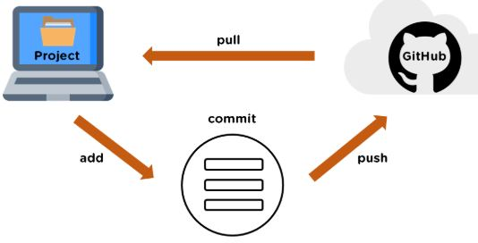

# Tech201-git-github
Tech201-git-github
## Heading2
### Heading 3
- Let's create our Markdown file
- This line is added on localhost

## Creating a Repo
- You want to start by creating a repo in github, making sure to name the repo, give it a description and add a README.me file before creating.
- You then need to copy the HTTP of the file so that you can now pull the repo to your local machine.
- Now open git bash and create a new directory using `mkdir 'directory name'`
- You now need to change to that directory using the command `cd 'File name'`
- To observe that we are no in this new folder you need to now use the command `pwd`
- Once you are in the new folder you need to use the command `git clone 'the url of the repo you created earlier '` 
- You now need to use `cd 'file name'` to enter the file you created and the README.me file should be inside (check this with `ls`.
- You can now use the command `nano 'file name'` to edit the file as you would like.
- Once you are done editing you want to use `^X` `Y` `Enter` and this should save the changes made in the file.
- Now all you need to do is send this back into your github repo. Start by using the command `git add .`
- You then need to use `git status` and make sure the file is highlighted green.
- Next use `git commit -m 'message` and this should allow you to save and prepare the changes to push them on back on to github
- Finally you can use `git push -u origin main` and this will push the changes onto github. Make sure to refersh your browser to view these changes on github.

